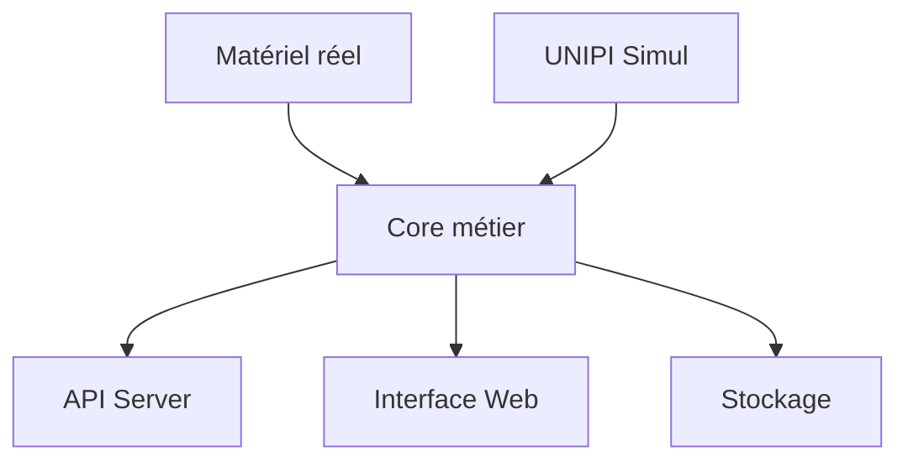

# Architecture GeV5

```mermaid
flowchart TB
    HW[Matériel réel] --> CORE[Core métier]
    SIM[UNIPI Simul] --> CORE
    CORE --> API[API Server]
    CORE --> WEB[Interface Web]
    CORE --> STORE[Stockage]
```
