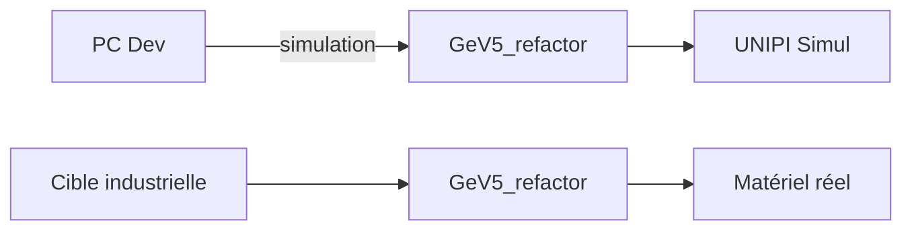

# Déploiement

```mermaid
flowchart LR
    DEV[PC Dev] -->|simulation| CORE1[GeV5_refactor]
    CORE1 --> SIM[UNIPI Simul]

    TARGET[Cible industrielle] --> CORE2[GeV5_refactor]
    CORE2 --> HW[Matériel réel]
```
