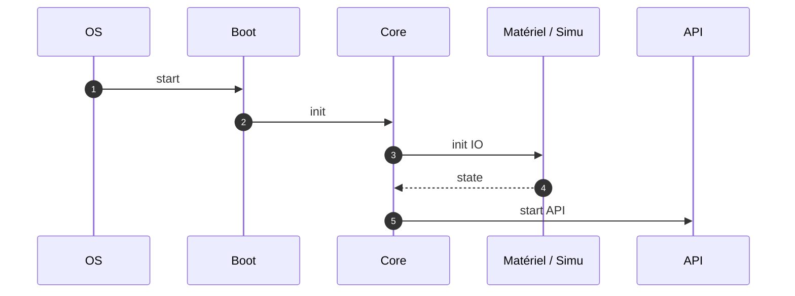

# Séquence de démarrage (Boot → Matériel → API)

```mermaid
sequenceDiagram
    autonumber
    participant SYS as OS
    participant BOOT as Boot
    participant CORE as Core
    participant HW as Matériel / Simu
    participant API as API

    SYS->>BOOT: start
    BOOT->>CORE: init
    CORE->>HW: init IO
    HW-->>CORE: state
    CORE->>API: start API
```
